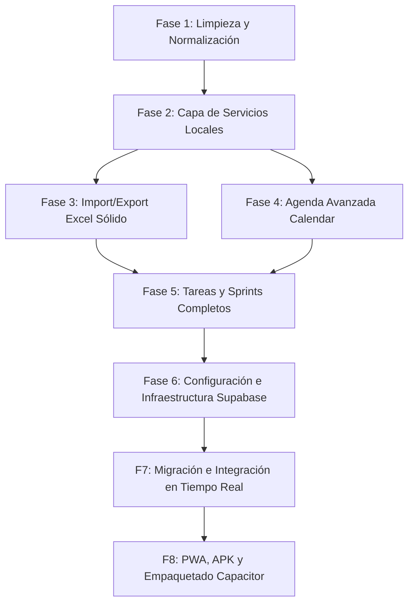

# Hoja de Ruta de Implementación — ROADMAP ASCK CRM v1.8+

Este documento detalla el plan de trabajo por fases para estructurar, estabilizar y potenciar el CRM interno de ASCK Software de forma incremental, minimizando riesgos y asegurando la continuidad operativa del sistema actual.

---

## Roadmap del Proyecto

---

## Detalle de Fases de Implementación

### FASE 1 — Limpieza y Normalización
* **Objetivo:** Refactorizar el archivo central `App.jsx` para separar la lógica de rutas y modularizar el estado reactivo principal, introduciendo tipos de datos consistentes.
* **Archivos a tocar:**
  * [App.jsx](file:///c:/Users/as832/Documents/CRM%20ASCK/src/App.jsx)
  * Creación de `src/hooks/useClients.js`, `src/hooks/useTasks.js`, `src/hooks/useSprints.js`.
* **Clasificación de Riesgo:** 🟡 Medio (posible pérdida temporal de estados cruzados al desacoplar).
* **Prueba de Aceptación:** La aplicación debe compilar con `npm run build` y mantener todos los datos semilla cargados sin alterar el diseño visual actual del Dashboard.

---

### FASE 2 — Servicios Desacoplados
* **Objetivo:** Crear una capa de servicios genéricos con proveedores dinámicos de persistencia (LocalStorage y Supabase) utilizando un patrón Provider/Adapter.
* **Archivos a tocar:**
  * Todos los archivos en `src/services/` (`clientService.js`, `taskService.js`, etc.).
  * Creación de un switch de configuración global `src/services/config.js`.
* **Clasificación de Riesgo:** 🟢 Bajo.
* **Prueba de Aceptación:** Al alternar el switch de base de datos a "Local", el CRM lee y escribe en `localStorage`. Al cambiarlo a "Supabase" (en desarrollo), falla controladamente indicando falta de conexión con las credenciales anon.

---

### FASE 3 — Excel Import/Export Sólido
* **Objetivo:** Fortalecer el componente de importación para evitar de forma estricta los registros duplicados de prospectos (mediante coincidencia exacta de nombre de negocio o correo), y proporcionar retroalimentación visual interactiva al usuario.
* **Archivos a tocar:**
  * [ExcelImportExport.jsx](file:///c:/Users/as832/Documents/CRM%20ASCK/src/components/ExcelImportExport.jsx)
* **Clasificación de Riesgo:** 🟢 Bajo.
* **Prueba de Aceptación:** Al importar un archivo Excel con un negocio llamado "Clínica Dental Advance" (que ya existe), el sistema debe reportar: `1 fila actualizada / 0 duplicados creados`.

---

### FASE 4 — Agenda Avanzada (Google Calendar-style)
* **Objetivo:** Pulir y expandir el componente de agenda para permitir la creación interactiva de eventos sobre celdas de horarios, asignación de colores según el tipo de evento y vistas responsivas adaptadas a móvil.
* **Archivos a tocar:**
  * [CalendarAgenda.jsx](file:///c:/Users/as832/Documents/CRM%20ASCK/src/components/CalendarAgenda.jsx)
* **Clasificación de Riesgo:** 🟢 Bajo.
* **Prueba de Aceptación:** Al hacer clic en una celda vacía de la agenda a las 10:00 AM del Miércoles, se debe abrir el modal pre-llenado con esa fecha y hora para la creación instantánea de un evento.

---

### FASE 5 — Gestión de Tareas y Sprints
* **Objetivo:** Conectar el tablero TÚDU con los sprints operativos activos y calcular de forma reactiva el porcentaje de avance de cada integrante para el sprint seleccionado.
* **Archivos a tocar:**
  * [TaskManagerTudu.jsx](file:///c:/Users/as832/Documents/CRM%20ASCK/src/components/TaskManagerTudu.jsx)
* **Clasificación de Riesgo:** 🟢 Bajo.
* **Prueba de Aceptación:** Al marcar una tarea del Sprint 1 como "Completada", la barra de progreso del sprint en la cabecera debe incrementarse proporcionalmente de forma instantánea.

---

### FASE 6 — Infraestructura de Producción (Supabase Setup)
* **Objetivo:** Crear el proyecto en Supabase, diseñar el esquema relacional en PostgreSQL compatible con UUIDs y tipos nativos, y configurar políticas de seguridad RLS básicas.
* **Archivos a tocar:**
  * Creación de `src/services/api/schema.sql` (adaptado a PostgreSQL).
  * Configuración de variables de entorno `.env`.
* **Clasificación de Riesgo:** 🟡 Medio.
* **Prueba de Aceptación:** La consola de Supabase debe reflejar las 7 tablas creadas con sus respectivas restricciones de clave foránea e índices.

---

### FASE 7 — Migración y Sincronización en Tiempo Real
* **Objetivo:** Activar el proveedor de Supabase en el switch de servicios, migrar los datos locales existentes y habilitar la sincronización en tiempo real de actividades y tareas entre dispositivos.
* **Archivos a tocar:**
  * [supabase.js](file:///c:/Users/as832/Documents/CRM%20ASCK/src/services/supabase.js)
  * Capa de adaptador de servicios.
* **Clasificación de Riesgo:** 🔴 Alto (riesgo de colisión de datos durante la migración inicial).
* **Prueba de Aceptación:** Al editar el estado de un prospecto en la computadora, el cambio debe reflejarse en la pantalla del celular en menos de 2 segundos sin necesidad de recargar la página.

---

### FASE 8 — Distribución PWA y Empaquetado Móvil
* **Objetivo:** Optimizar el Service Worker para actualización en segundo plano (Stale-While-Revalidate), y configurar Capacitor para compilar el código web a una aplicación móvil nativa Android (.apk).
* **Archivos a tocar:**
  * [sw.js](file:///c:/Users/as832/Documents/CRM%20ASCK/public/sw.js)
  * [manifest.json](file:///c:/Users/as832/Documents/CRM%20ASCK/public/manifest.json)
  * Inicialización de Capacitor (`capacitor.config.json`).
* **Clasificación de Riesgo:** 🟡 Medio (compatibilidad del renderizado de CSS de Tailwind con webviews de Android antiguos).
* **Prueba de Aceptación:** Ejecutar la aplicación en un dispositivo Android mediante el empaquetado de Capacitor, logrando abrirla de manera independiente y fluida sin marcos del navegador.
